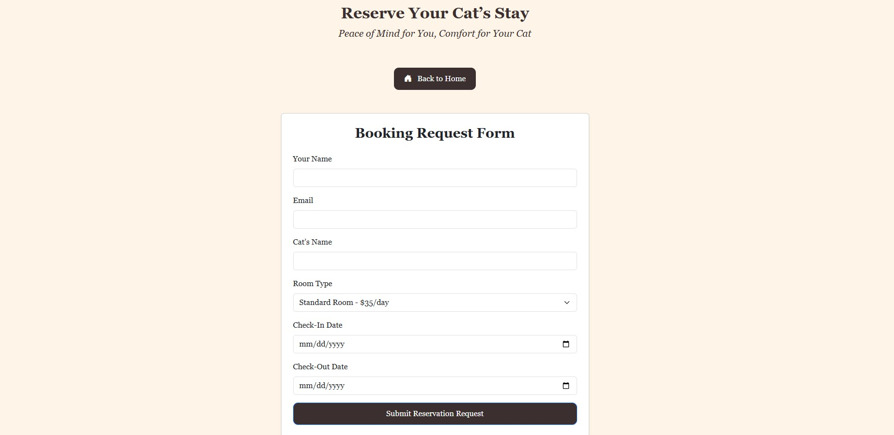

# Project-1-CatHotel
## Developer: [Hazel Arevalo](https:///linkedin.com/in/harevalo123)
Purrfect Stay is a cat boarding web application designed to make caring for your feline friend simple and stress-free. Our site allows cat owners to explore our cozy accommodations, learn about our trusted services, and easily book stays online. Whether you’re planning a weekend getaway or a long vacation, Purrfect Stay ensures your cat enjoys a comfortable, safe, and loving home away from home.
## Features
- Responsive front-end design using HTML, CSS, Bootstrap, and JavaScript
- Image carousel and testimonial sections to showcase customer experiences
- Dynamic service and rate listings with organized layouts
- Embedded Google Map and contact form for direct communication
- Lightweight, accessible, and optimized for performance
## Technology Used
1. HTML
2. CSS
3. Bootstrap v5.3.8
4. JavaScript
## Wireframes
### Home Page – Desktop Version

### Tour the Hotel Page – Mobile Version

### Preparing for Your Stay Page – Mobile Version

### Our Services Page – Desktop Version

### Gallery Page – Desktop Version

## Screenshots

## User Stories
1. As a cat owner who needs to board my cat while moving apartments, I want to reserve their stay online, so that I can focus on moving while knowing my cat is safe and cared for.
    - Acceptance Criteria: 
        1. User can view available room types and dates.
        2. Online booking form collects cat and owner details.
        3. System confirms reservation and displays a success message.
2. As a cat owner planning a vacation, I want to explore local boarding services and learn more about the facility, so that I can feel confident and trust where my cat will be staying while I’m away.
    - Acceptance Criteria:
        1. User can view photos and descriptions of the facility and rooms.
        2. Testimonials and customer reviews are available on the site.
        3. Awards are visible.
        4. Contact information and location map are easy to find.
3.  As a cat owner who needs to plan ahead for boarding expenses. I want to easily find and compare daily rates on the website, so that I can budget accordingly and choose the best accomodations for my cat.
    - Acceptance Criteria:
        1. Daily rates are clearly displayed on a dedicated "rates" section or page.
        2. Pricing is transparent with no hidden fees.
        3. Information is mobile-friendly and easy to read.
## Ideas for Future Improvement
1. User can request pickup/drop-off during the booking process.
2. User receives notification once their cat has been transported.
3. User can Pay Online using the booking system.
4. Returning users can save their cat's information, vaccination records, and past bookings. 

